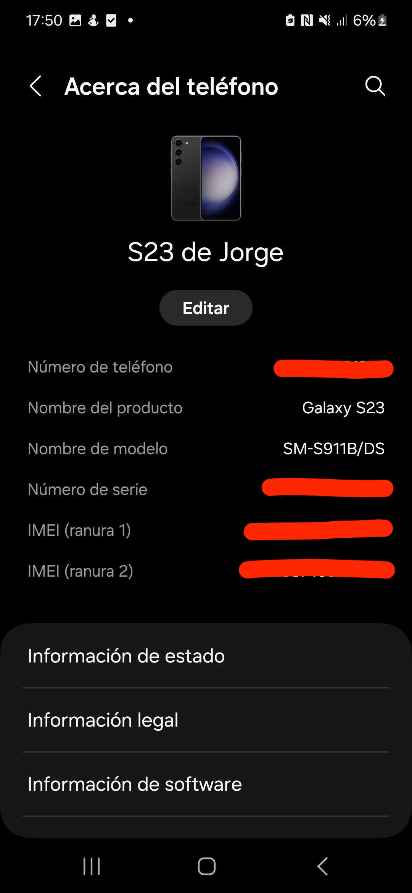

# Hardware serials

Please fill in your details in this [worksheet](https://docs.google.com/spreadsheets/d/17m4oCpdMDqBIbVGonnpGqMsnquwC1m6luj7pF50o108/edit?usp=sharing).

>Only google monstar-lab.com accounts can access it

Here you can find istructions for finding serial numbers of your hardware

- [MacBook](#laptop-macbook)
- [Windows](#laptop-windows)
- [Iphone](#mobiles-iphone)
- [Samsung](#mobiles-samsung)

## Laptop MacBook

In order to find the serial of your MacBook Open ``System Settings`` from the Apple icon in the top left of your screen

In the search box in the top left of the ``System Settings`` window write ``about`` or ``informacion`` or ``serial`` and click the first item in the list

Here you can find the serial of your macbook.

## Laptop Windows

Please refer to [this page](https://www.howtogeek.com/294712/how-to-find-your-windows-pcs-serial-number/) to see how to see the serial number of your windows laptop.

## Mobiles Iphone

> Serials listed in the [worksheet](https://docs.google.com/spreadsheets/d/17m4oCpdMDqBIbVGonnpGqMsnquwC1m6luj7pF50o108/edit?usp=sharing) in some cases can have a leadind ``S`` or ``C`` with respect to the serial you find in your terminal.

In an Iphone open ``settings`` or `Àjustes`` and in the search input put ``about`` or `ìnformacion`` or ``serial``, then click the ``about`` or `ìnformacion`` item.

## Mobiles Samsung

Open ``settings`` or ``Ajustes``  then select ``About`` or ``Acerca del teléfono``.
In the [worksheet](https://docs.google.com/spreadsheets/d/17m4oCpdMDqBIbVGonnpGqMsnquwC1m6luj7pF50o108/edit?usp=sharing), tab ``Mobile - Samsung``, you should look for one of the **IMEI** (tipically the first one) shown in the page.

 
