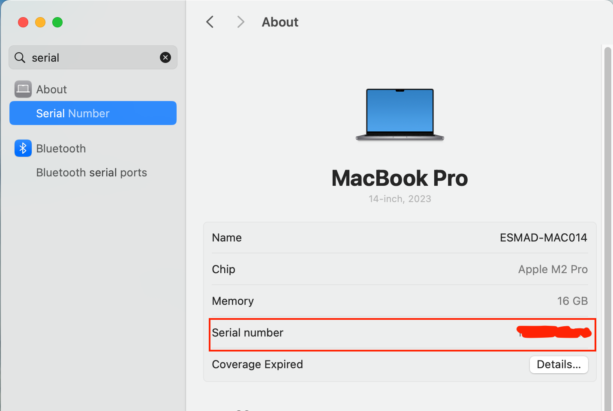
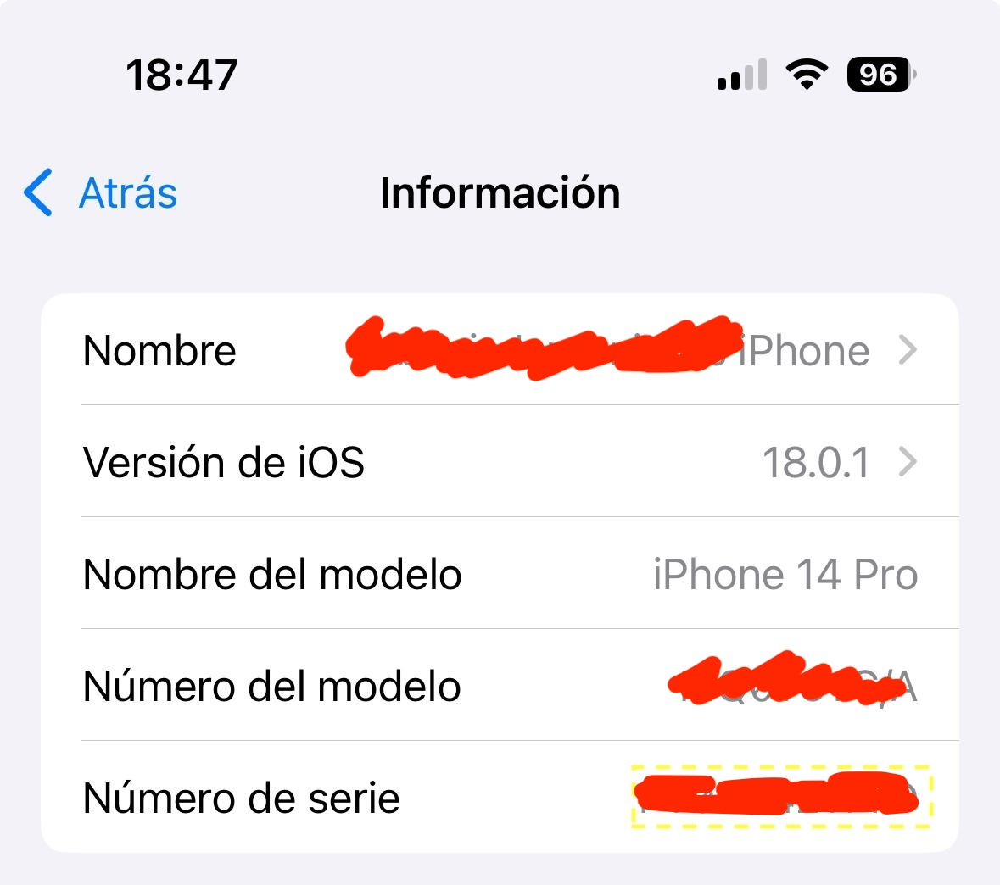

# Hardware serials

Here you can find istructions for finding serial numbers of your hardware

## Laptop - MacBook

In order to find the serial of your MacBook Open ``System Settings`` from the Apple icon in the top left of your screen


In the search box in the top left of the ```System Settings`` window write ``about`` or `ìnformacion`` or ``serial`` and click the first item in the list



Here you can find the serial of your macbook.


## Laptop Windows

Please refer to [this page](https://www.howtogeek.com/294712/how-to-find-your-windows-pcs-serial-number/) to see how to see the serial number of your windows laptop.


## Mobiles - Iphone

In an Iphone open ``settings`` or `Àjustes`` and in the search input put ``about`` or `ìnformacion`` or ``serial``, then click the ``about`` or `ìnformacion`` item.


