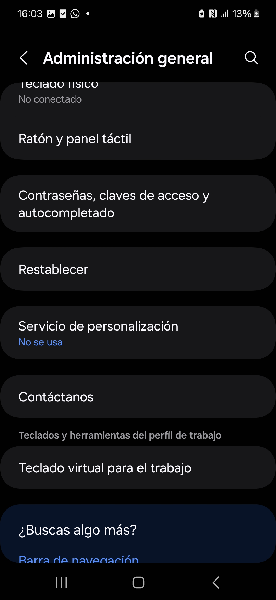
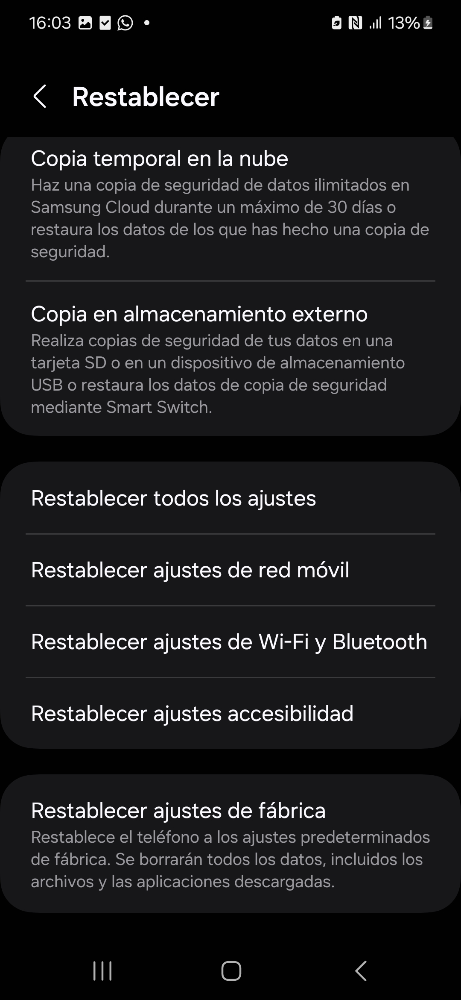

# Istruciones para hacer un reset de un Android

> **¡Cuidado! Las siguientes operaciones son irreversibles**

Ir a Ajustes > Administración general > Restablecer > Restablecer ajustes de fábrica > Restablecer

Se abrirá pantalla en donde te dirá que debes “Introducir tu PIN actual”
Pulsar "Eliminar todo"
Se abrirá otra pantalla en donde debes verificar identidad mediante el método que te diga (contraseña, huella, PIN...)
Una vez hayas verificado la identidad el móvil se reestablecerá de fábrica y reiniciará.

FIN, puedes apagar el móvil que ya está restablecido de fábrica.
